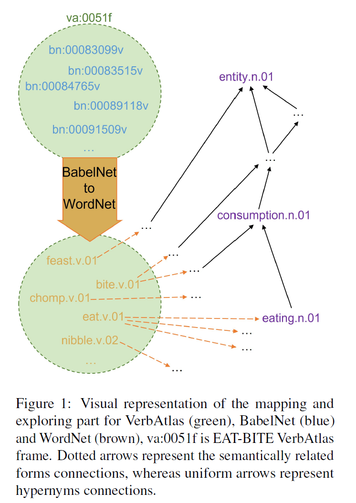

# NLP - Nominal Events for VerbAtlas

Goal: create a nominal resource corresponding to and integrated with VerbAtlas.

Why? Isn’t PropBank enough? No: 
1) language coverage 
2) multilinguality

    

The **report.pdf** file describes the solution adopted, compared with alternative approaches to the problem.
